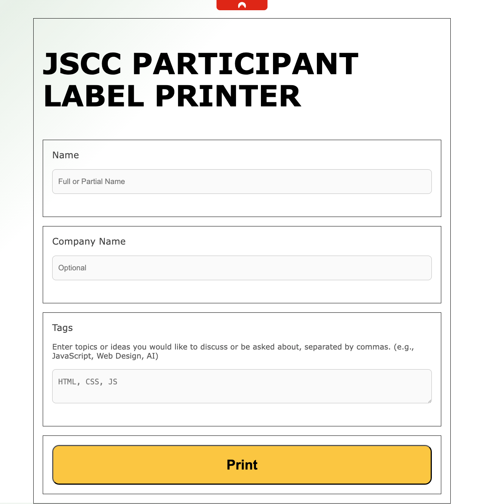

# JSCC-ZPL-Printer

An open-source project for the printer which prints the JSCC (JavaScript Conference) badges using ZPL (Zebra Programming Language).

## Context:
I acquired a ZPL Printer. I didn't know what to do with it. 
During one of the early Orga meetings of JSCC, I suggested that we could print the badges using this printer.
I didn't even know how to use it. The process of making it work went like this:

Ethernet cable. The printer gets and IP to see what you can do what you get via the web interface.
You can send ZPL commands via the terminal. I didn't event know ZPL.

Anyway, after some tinkering, I managed to get it working. Leo came up with the idea of running it on the network. And Patrick helped with the computer and on the fly code changes.

V1 Looks like this:



## Example ZPL Code:
Example command to send ZPL to a printer from Mac (nc):
```
echo "^XA^FO10,100^A0,N,136,136^FD#JSCC25^FS^FO100,240^A0,N,100,100^FDPHILIP SAA^FS^XZ" | nc 192.168.1.16 9100
```

Example command to send ZPL to a printer from Windows (ncat):
```
echo "^XA^FO10,100^A0,N,136,136^FD#JSCC25^FS^FO100,240^A0,N,100,100^FDPHILIP SAA^FS^XZ" | ncat 192.168.1.16 9100
```