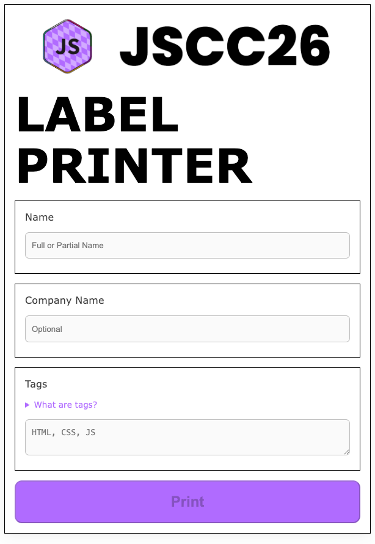

# JSCC-ZPL-Printer

An open-source project for printing JSCC (JavaScript Conference) badges using ZPL (Zebra Programming Language) on an Intermec PC43t label printer.

---

## Client App



---

## Hardware Setup

You need:
- A Mac mini (or any macOS machine) as the server
- An Intermec PC43t (300 dpi) label printer
- A USB cable connecting the printer to the Mac mini
- The Mac mini connected to the conference WiFi/LAN so participants can reach it

```
[Participants on WiFi] --> [Mac mini via LAN] --> [Printer via USB]
```

---

## macOS Printer Driver

The Intermec PC43t requires the **Gutenprint** open-source driver on macOS. Install it via Homebrew:

```
brew install gutenprint
```

After installing, restart your Mac (or restart CUPS: `sudo launchctl stop org.cups.cupsd`) before adding the printer.

---

## Printer Setup (one-time)

1. Connect the printer to the Mac mini via USB and power it on
2. Open **System Settings → Printers & Scanners**
3. Click **+** to add the printer — it should appear as `Intermec PC43t`
4. Once added, open Terminal and run:
   ```
   lpstat -p
   ```
   This lists all printers registered with CUPS (macOS's print system). The server auto-detects installed printers and populates a dropdown in the UI — no manual copy-paste needed.

5. If the printer shows as **Paused**, re-enable it:
   ```
   cupsenable Intermec_PC43t_300_FP
   lpadmin -p Intermec_PC43t_300_FP -E
   ```

---

## Server Setup

### 0. Prerequisites

- **Node.js 22.6+** — required for native TypeScript support (`node server.ts` runs without a build step)

### 1. Clone and install

```
git clone <repo-url>
cd jscc-zpl-printer
npm install
```

### 2. Configure environment

Copy the example and fill in your values:
```
cp .env.example .env
```

```env
VITE_PRINTER_NAME=Intermec_PC43t_300_FP   # optional — overrides the UI printer dropdown

# Optional: override auto-detected label dimensions (in printer dots at 300dpi)
# e.g. 4"x6" = 1200x1800, 4"x3" = 1200x900, 40mm×60mm = 472x709
# LABEL_WIDTH_DOTS=1200
# LABEL_HEIGHT_DOTS=1800
```

`VITE_PRINTER_NAME` is optional. When omitted, the UI shows a dropdown of all printers detected on the machine. Label dimensions are auto-detected via IPP and only need to be overridden if auto-detection doesn't work.

### 3. Build and run

```
npm run build
npm run server
```

The server starts on `http://localhost:3000` and serves the UI from the built `dist/` folder.

---

## Network Setup

### Recommended: bring your own router

Venue WiFi often has **client isolation** enabled, which blocks devices from reaching each other even on the same network. A travel router avoids this entirely.

```
[Participants on your WiFi] --> [Your router] --> [Mac mini] --> [Printer via USB]
```

1. Connect the Mac mini to your router (ethernet or WiFi)
2. Participants connect to your router's WiFi SSID
3. That's it — no venue dependency, no IT coordination needed

### Alternative: venue WiFi

Connect the Mac mini to venue WiFi. This works only if the venue allows device-to-device traffic. Many venues block it via client isolation — test before participants arrive.

### Finding the Mac mini's IP

```
ipconfig getifaddr en0 || ipconfig getifaddr en1
```

(`en0` is typically the active interface on newer Macs; `en1` on older ones.)

Open `http://<mac-mini-ip>:3000` from any device on the same network to verify.

**Tip:** Use the **Print WebClient QR** button in Admin Actions — it prints a label with a QR code pointing to the correct IP automatically. Print one and scan it to confirm everything works before participants arrive.

---

## Participant data

Each participant has a `.json` file in the `sourceDir/` directory. See `sourceDir/philip_saa.json` for an example. The relevant fields for printing are:

```json
{
  "realName": { "givenName": "Philip", "familyName": "Saa" },
  "company": "Saab Deutschland GmbH",
  "tags": ["TypeScript", "React", "Svelte"]
}
```

---

## Printing

| Action | How |
|---|---|
| Print a single badge | Fill in the form and click **Print** |
| Print all participant badges | Open Admin Actions (`?admin` in the URL) and click **Print All Participants** |
| Print the QR code label | Open Admin Actions and click **Print WebClient QR** — open the app via the Mac mini's network IP first so the QR encodes the right URL |
| Test printer connectivity | Open Admin Actions and click **Test Printer Connection** |

> Admin Actions are hidden by default. Append `?admin` to the URL to reveal the Admin button (e.g. `http://192.168.1.100:3000?admin`).

---

## Updating for next year

Change the year in one place — `src/shared/constants.ts`:

```ts
export const JSCC_YEAR = 26;
```

Then rebuild:
```
npm run build
```

---

## Development

Run the backend and frontend separately:

```
npm run dev:server   # backend on http://localhost:3001
npm run dev          # Vite frontend on http://localhost:3000
```

A banner is shown in the UI when running in dev mode — print actions are simulated and no actual print job is sent.

---

## ZPL reference

Send ZPL directly from the terminal (macOS):
```
echo "^XA^FO50,50^A0N,80,80^FDTEST^FS^XZ" | lp -d Intermec_PC43t_300_FP -o raw
```

Send ZPL directly over the network (the printer's IP is shown on its screen):
```
echo "^XA^FO50,50^A0N,80,80^FDTEST^FS^XZ" | ncat <printer-ip> 9100
```